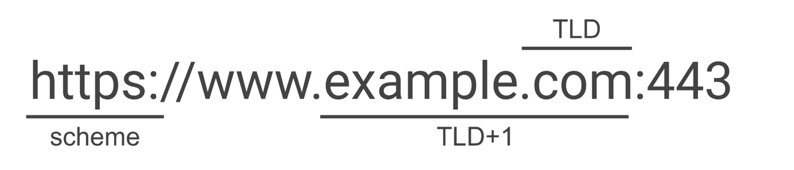

# 浏览器底层原理

## 浏览器架构

现代浏览器都采用多进程的架构设计，主要包括以下进程：

- 浏览器进程（主进程）
- 渲染进程（多个）
  - 主线程（main thread）：Blink渲染引擎，负责页面的渲染（HTML解析、CSS解析、Layout、Paint）；Blink内置了V8引擎，负责JavaScript的解释执行。
  - 合成器线程（impl thread ）：在早期的Chrome设计中并不存在，后续引入合成器线程主要目的是将布局树拆分为多个图层Layer进行独立的光栅化和渲染，最终再重新合成为一张位图。
- GPU进程
  - 内部通过2D图形库Skia间接调用OpenGL接口来实现画面的绘制。
- 网络进程
  - 负责网络通信等功能。
- 插件进程（多个）


> HTML和Canvas的渲染，本质都是在主线程产出绘制指令交给GPU进程的Skia来间接OpenGL绘制，这也是为什么他们都能享受到GPU提供的硬件加速能力（如借助GPU执行Shader来快速地实现类似高斯模糊的效果，如果在CPU主线程实现则是巨大的开销）
>
> 而WebGL则是允许我们直接和GPU进行交互，少去了中间层层封装引入的开销，也允许我们更好的定制化功能。


## 浏览器渲染流程

- 构建DOM树（Parse HTML）
  - 通过HTML解析器实现字符流 -> token流 -> 抽象语法树（即DOM树）
- 样式计算（Recalculate style）
  - 通过CSS解析器生成styleSheets，也被称为CSSOM，可以通过`window.styleSheets`访问。
  - 属性值标准化，把类似`color: red`等非标准值转化为`color: rgb(255, 0, 0)`。
  - 计算出每个DOM节点的最终样式并存在内部的一个被称作ComputedStyle的巨大Map中，可以通过`window.getComputedStyle`访问特定DOM节点的值。
- 布局（Layout）
  - 我们已经构建了DOM树和所有节点的样式信息，那么就可以生成一个布局树（有的地方也称作渲染树），这一步还会去掉原本DOM树上不可见的节点（比如`<head />`标签或应用了如`{ display: none }`样式的节点）
  - 使用复杂的算法计算出每个节点的绝对**坐标信息**（x、y、width、height）
- 分层（Layerise）
  - 分层是一个**性能优化**手段，在早期的Chrome架构实现其实是不存在分层这一步骤的。
  - 简单来说的话，分层可以把一颗完整的布局树拆分成多棵子树（Layers），后续再独立光栅化来绘制，最终重新合成为一张完整的位图。这么做的一个好处是避免局部状态更新触发全局的渲染。
  - 怎样的节点会被提升到一个独立的渲染层当中：（TODO）
- 预先绘制（Pre Paint）
  - 涉及到属性树的生成，暂且不提。
- 绘制（Paint）
  - 这一步的绘制并不是真的把内容绘制到屏幕上。这里说的绘制的本质是对布局树的解释执行，对于每一个待绘制的节点都能得到一组**绘制指令**，这个绘制指令会在后续的流程中用来实现真正的画面绘制。
- 提交（Commit）
  - 主线程Paint生成的绘制指定提交给合成器线程。这一步之前的操作都发生在主线程，这一步之后的操作主要发生在合成器线程，光栅化则是发生在GPU进程当中。
- 分块（tiling）
  - 这也是一个**性能优化**手段。光栅化整个Layer是比较昂贵的开销，特别是我们不需要光栅化可视区域外的内容，因此我们可以把Layer切分成多个图块进行光栅化。
- 光栅化（raster）
  - 光栅化即通过绘制指令生成位图的过程，也就是真正的绘制操作。在Chrome内部这是通过运行在GPU进程中的图形库Skia实现的，而Skia的底层其实是基于OpenGL的。通常光栅器的实现有基于CPU实现的软光栅器，比如使用线性扫描算法实现逐像素的填充；除此之外还有基于GPU实现的光栅器（即硬件加速），通过片段着色器VS实现并行的计算逻辑。
  - 光栅化还包括图像的解码过程，如``
- 合成
  - 分块（tile）经过光栅化的产物得到了位图quads，然后通过合成器线程执行`draw quads`则会把这些位图合并成一张完整的位图写入帧缓冲当中，显卡读取后显示在显示器上被我们看到。


> 补充：
>
> 上述流程是早先的Chrome渲染架构，和最新版本的实现会有部分细节出入，但整个思想是一致的。最新版本Chromium已经把分层Layerise这一步骤放在绘制Paint这一步之后了，以及光栅化可能也会用一个新的worker线程来跑这些细节差异。
>
> 参考：
>
> 1. https://docs.google.com/presentation/d/1boPxbgNrTU0ddsc144rcXayGA_WF53k96imRH8Mp34Y/edit#slide=id.ga884fe665f_64_6
>

### 重排（Reflow）

当我们页面渲染完成后，即使我们什么都不操作显示器也会根据特定的频率读取帧缓冲的内容进行显示。为了让用户看到的内容发生变化，我们需要反复触发HTML渲染管线写入新的数据到帧缓冲当中。当然了，我们不需要重新走这个完整流程，而是可以复用之前创建的布局树这个数据源，比如只修改某个渲染层的某个节点的背景颜色，这样就不需要进行重新布局这样的复杂计算了。

但有的时候，比如我们需要新增DOM节点，这样会导致我们的布局信息发生变化，因此我们需要重新执行布局这一步骤。这也被称之为重排Reflow。布局涉及到复杂的坐标计算，是个比较花费性能的操作，频繁触发重排会影响整个页面的渲染体验。


哪些常见操作会触发重排：

1. 添加或删除DOM元素
2. 修改DOM元素的几何属性（x、y、width、height）


### 重绘（Repaint）

如果我们只是修改了某个DOM节点的背景颜色，那么我们的布局树只是某个属性发生了变化，不需要重新进行复杂的坐标计算。只是在绘制的步骤中需要解析成一个不同的绘制指令，整体的性能开销是比较小的。


哪些常见操作会触发重绘：

1. 修改DOM节点的颜色、背景颜色等非几何信息

### 合成（Composite）

我们都知道，主线程中可用来渲染一帧的时间是宝贵的16ms。其中一部分时间会被用来执行JS，剩下的时间才是主线程的渲染阶段，渲染所需要花费的时间越长则越可能引起页面的卡顿。那么，我们有没有办法在修改DOM属性时不触发重排或者重绘，来优化页面性能呢？

答案是有的。我们可以把一些操作放到合成器线程中执行，比如CSS3的`transform`与其在主线程中计算出新的绘制指令，我们可以在合成器线程中实现样式调整，从而缓解主线程的开销。除了`transform`还有`opacity`、`filter`等属性也能享受到一样的性能提升，网上也称之为**CSS硬件加速**，我猜测可能是合成器线程又和渲染进程通信来借助了GPU的并行计算能力来实现的。


### 强制同步布局（forced synchronous layouts）


渲染一帧的顺序可以简化为上图。当我们通过JavaScript尝试访问某个DOM节点的几何信息时，实际上是通过上次渲染时的布局树拿到的几何信息。当我们先修改了DOM节点的样式后，浏览器会认为节点的几何信息也可能发生变更，因此当我们再去尝试读取节点的几何坐标信息时，浏览器会强制性**重新计算样式并重新布局**来获取到最新的几何信息。这样会带来高昂的性能成本。

``` js
// 先写后读。触发了强制同步布局，性能劣化
function logBoxHeight () {
  box.classList.add('super-big');

  console.log(box.offsetHeight);
}
```

一般来说我们先读后写就好，其实读取到的是上一帧渲染时布局树的几何信息也问题不大。下面的代码也是类似的，整个JS任务执行的过程中出现了多次先写后读，疯狂的重排导致性能劣化更加严重。

``` js
function resizeAllParagraphsToMatchBlockWidth () {
  // 第一个循环中写入样式；第二个循环中读取样式
  for (let i = 0; i < paragraphs.length; i++) {
    paragraphs[i].style.width = `${box.offsetWidth}px`;
  }
}
```


当触发强制同步布局时，我们可以在Chrome开发者工具性能面板中对应的样式计算中看到Recalculation forced的标识，以及对应的


> TODO：
>
> 1. 重排的范围
> 2. 性能优化
> 3. 渲染层提升


## 输入URL后发生了什么

经常遇到的问题，我们可以在浏览器渲染流程的基础上展开去聊，简单来说包括以下关键知识点（部分细节有省略）：

1. 网络通信过程

   1. URL解析得到协议、域名、端口、路径

   2. DNS域名解析

      1. 递归查找缓存。先依次尝试从浏览器缓存、操作系统缓存、Hosts文件、路由器缓存、本地DNS服务器（即本地网络中设置的DNS服务器地址）缓存，解析到域名对应的IP地址。

      2. 迭代DNS服务器。

         1. 向根DNS服务器查询顶级域DNS服务器的地址
         2. 向顶级域DNS服务器查询权威域名DNS服务器的地址
         3. 向权威域名DNS服务器查询目标域名对应的IP地址

         

   3. 三次握手建立TCP连接

      1. 客户端发送一个SYN=1，Seq=X的TCP包
      2. 服务端返回一个SYN=1，ACK=X+1，Seq=Y的TCP包
      3. 客户端发送一个ACK=Y+1，Seq=Y + 1的TCP包

   4. （可选）如果是HTTPS（具体实现可见计算机网络章节）

      1. TLS握手，交换版本信息、加密算法、压缩算法、随机数（浏览器一个，客户端一个）。
      2. 服务端发送证书（包括公钥和CA私钥对该公钥的签名）给客户端，客户端使用CA公钥对签名进行验证。
      3. 使用服务器公钥生成对称密钥，用户后续的加密解密（实际的实现要复杂亿点点）

   5. 发送HTTP请求并接收响应。

      1. 查看浏览器内是否有资源的缓存
         1. 存在缓存，检查缓存是否过期
            1. 没过期，使用缓存的内容进入后续的渲染流程
            2. 缓存已过期，查询服务端的对应资源是否修改过，如果资源未修改过则使用本地缓存；如果资源修改过则使用更新过的缓存资源
         2. 不存在缓存，进入下一步
      2. HTTP报文封装成TLS报文、再打上端口号封装成TCP报文、再打上源IP地址和目标IP地址封装成IP报文。借助路由表查询目标IP地址的下一跳路由，使用ARP查询到路由器的MAC地址，再把IP报文附上MAC地址，最后通过链路层进行传输。

   6. 四次挥手关闭TCP连接

2. 浏览器渲染流程。（完整的浏览器渲染流程在上一章节已经介绍了，下面主要介绍一些扩展内容）

   1. HTML解码。根据响应头指定的编码方式进行解码，若不存在则根据HTML的`meta`中指定的编码方式进行解码。
   2. 资源预解析。会将HTML中涉及到的网络资源提前加入到请求队列当中。


## HTTP缓存

HTTP缓存分为**强制缓存**和**协商缓存**。

当浏览器向服务器请求资源时：

1. 首先查看浏览器是否有资源的缓存，若不存在缓存则直接向服务器请求资源

2. 若存在缓存，根据**资源对应的响应头部**`Cache-Control: max-age`或 `Expires` 判断资源是否过期。

   其中`Cache-Control: max-age`使用的相对的时间，而`Expires`指的是某一个具体的时刻，为了避免不同机器中时间误差来带的问题，使用前者更好。

   1. 若缓存没过期，则浏览器不会向服务器发请求，而是直接读取缓存中的资源，这叫做**强制缓存**。 此时在`Network`一栏中看到资源对应的状态码为200（虽然实际上并不存在HTTP请求）。如果我们是直接刷新页面，资源会从内存缓存中读取：`200(from memory cache)`；如果我们是打开了新的页面，资源会从硬盘缓存中读取: `200(from disk cache)`
   2. 若缓存已过期，我们需要向服务器查看服务器中的该资源是否有被修改，如果服务器中的资源没有被修改，我们会直接读取本地的缓存资源，这叫做**协商缓存**，状态码为`304(Not Modify)`；如果服务器中的资源被改动了，那么服务器需要把改动后的资源作为响应体发给浏览器，状态码为`200(OK)`。
      1. 如果资源对应的响应头部有`Etag`，那么我们发送的请求需要带上`If-None-Match`
      2. 如果资源对应的响应头部有`Last-Modified`，那么我们发送的请求需要带上`If-Modified-Since`
      3. 服务器收到我们的请求后，根据这两个请求头部来判断资源是否修改过，进而决定是响应304还是200。


另外，通常我们不能用HTTP缓存来缓存一个非常大的资源。这种情况或许可以考虑使用`IndexedDB`来实现本地的存储。


### 强制缓存

``` js
const Koa = require("koa")
const app = new Koa()
const bluebird = require('bluebird')
const fs = bluebird.promisifyAll(require('fs'))
app.use(async ctx => {
    if (ctx.url === '/') {
        console.log(111);
        const file = await fs.readFileAsync('./dist/index.html')
        ctx.type = 'text/html'
        ctx.body = file
    }
    if (ctx.url === '/image.png') {
        console.log(222);
        const file = await fs.readFileAsync('./dist/image.png')
        ctx.set('Cache-Control', 'max-age=10')
        ctx.type = 'image/png'
        ctx.body = file
    }
})
app.listen(3000)
```


### 协商缓存

``` js
const getEtag = require('etag')
app.use(async ctx => {
    if (ctx.url === '/') {
        const file = await fs.readFileAsync('./dist/index.html')
        ctx.type = 'text/html'
        ctx.body = file
    }
    if (ctx.url === '/image.png') {
        const file = await fs.readFileAsync('./dist/image.png')
        const hash = getEtag(file)
        const etag = ctx.get('If-None-Match')
        if (etag && etag == hash) {
            ctx.status = 304
            ctx.body = ''
        } else {
            if (!etag) ctx.set('ETag', hash)
            ctx.type = 'image/png'
            ctx.body = file
        }
    }
})
```


## 浏览器客户端存储

### LocalStorage

持久化的本地存储，除非主动删除否则数据将一直存在。一般最大的存储量为5Mb。

``` js
localStorage.setItem('my_key', 'my_value')
localStorage.getItem('my_key')
localStorage.removeItem('my_key')
localStorage.clear()
```

### SessionStorage

会话级的本地存储，一旦页面被关闭，数据就会被清除。一般最大的存储量为5Mb。


### IndexedDB

浏览器内部的数据库，可用于存储大容量的结构化（或二进制数据）数据。目前有两个比较好用的库。

#### localforage库

更像容量加强版的LocalStorage，感觉读写性能并不是很高，特点是在不支持IndexedDB的浏览器中会从IndexedDB实现降级成LocalStorage实现。

``` js
const keys = await localforage.keys()
const hasLocalCache = keys.includes('my_key') // 自定义键名
if (hasLocalCache) {
    console.log('读取本地缓存');
    data = await localforage.getItem('my_key')
} else {
    console.log('读取后端数据');
    data = await fetch('./getData').then(res => res.json())
    localforage.setItem('my_key', data)
}
```

#### Dexie库

更贴近IndexedDB底层操作，读写性能更高。


## 用户登录鉴权

### Cookie

通常服务器使用`Set-Cookie`头部从而在浏览器种下Cookie，Cookie存放的数据不能大于4Kb。

一些常见的Cookie属性：

1. `expires`：Cookie的过期时间
2. `domain`：只能访问该域名时才会带上Cookie
3. `path`：表明只有访问该路径时才会带上Cookie
4. `httpOnly`：为`true`时，浏览器不能通过代码读取Cookie
5. `secure`: 为`true`时，只有发送HTTPS请求时才会带上Cookie
6. `SameSite`：默认为`lax`，详细解释见后文


### Session

通常使用`Session`时需要搭配上`Cookie`。通常单独使用`Cookie`时，会话数据都储存在`Cookie`中；使用`Session`时，`Cookie`中只存放一个`Session_id`这样的键，实际的会话数据存放在服务端中，比如可能存放在服务端的`redis`数据库中。


### 令牌Token

通常在登录成功后服务端会返回一个令牌Token（Access Token），浏览器可以自行进行存储（通常都存在LocalStorage中），后续的接口请求中把该Token放在特定请求头（如`Authorization: Bearer ${token}`）中进行传输。

我们可以自己指定Token的生成算法，比较主流的方式是下文将要介绍的JSON Web Token。

#### JWT

使用JWT来进行用户身份认证时，当我们输入用户名和密码进行登录时，服务器会将用户数据使用`Base64`转化成一个`token`字符串返回给前端，通常前端将这个`token`字符串保存在`localStorage`或`Cookie`中以供以后使用，在这之后发请求时会将`token`提取出来，或是放在`Authorization: Bearer ${token}`请求头部中，又或是直接作为请求的参数字段发送给后端，以供后端解析鉴权。

实际上`token`字符串由两个`.`分割三个部分：Header、Payload、Signature（签名）。

- Header字符串是由一个JSON对象通过`Base64`编码而来，这个JSON的结构如下：

  ``` json
  {
      "alg": "HS256",
      "typ": "JWT"
  }
  ```

  在这里`alg`表示的是签名是所使用的算法，默认值为`HMAC SHA256`。`typ`表示`token`的类型，默认为`JWT`。

- Payload是由我们的**会话数据**通过`Base64`编码得到的

- Signature是对前两个部分的签名，服务端通过前两个部分的值以及密钥生成该签名。

  ``` js
  HMACSHA256(
  	Base64URL(header) + "." + Base64URL(payload),
  	secretOrPrivateKey
  )
  ```


我们也可以使用Node的`jsonwebtoken`模块来实现该功能。

``` js
const jwt = require('jsonwebtoken')
const token = jwt.sign({ name: 'akara'}, 'key')
const data = jwt.verify(token, 'key')
```


### 鉴权方式对比

#### Cookie

**优点**

- （相比Session方案）Cookie完全存储在客户端，无服务器资源压力

**缺点**

- 存在跨域问题

- 存在CSRF问题

- 客户端存储能力有限，无法实现把用户踢下线等能力

  


#### Cookie+Session

**优点**

- 服务端管理Session，不容易出现盗用的情况，也可以实现把用户踢下线等能力

**缺点**

- 存在跨域问题
- 存在CSRF问题
- 增加了服务端的资源占用


#### Token

**优点**

- （相比Session方案）Token完全存储在客户端，无服务器资源压力

- （相比Cookie/Session方案）没有跨域问题

- （相比Cookie/Session方案）没有CRSF问题

  

**缺点**

- 客户端存储能力有限，无法实现把用户踢下线等能力


## 浏览器同源策略

当**协议**、**域名**、**端口**三者都完全相同，我们将其称为同源或同域。

**浏览器**受到同源策略的限制，所谓**同源策略**，即指在**没有授权的情况下**，不同的源无法读写对方的资源。比如，当我们处于`A.com`时向`B.com`发送`ajax`或`fetch`请求是会失败的。当然，如同`<script src="">`或`form`表单之类的操作不受同源策略的限制，因此可以请求到对方的资源。

### 跨域和跨站

#### 跨域（Cross Origin）

同源/同域要求两个源的协议、完整域名、端口号都完全相同。


#### 跨站（Cross Site）



同站要求两个源的顶级域和一级域都相同，即这里的`TLD+1`完全相同。


### 跨域资源共享（CORS）

浏览器同源策略的限制，使得我们无法在`qq.com`页面调用`weixin.com`或者`mobile.qq.com`域下的接口，这在很多时候不符合我们需求的预期，我们期望存在一种方式能绕过这个同源策略的限制，用的最多的就是这里将要介绍的CORS，后文还会介绍JSONP等方式。

想要实现CORS很简单，只需要给服务器的对应接口返回加上响应头部`Access-Control-Allow-Origin`即可，具体代码如下：

``` js
ctx.set('Access-Control-Allow-Origin', '*') // *代表任意源都可以请求我们的接口
// 或者
ctx.set('Access-Control-Allow-Origin', 'http://qq.com:3000') // 只有特定源可以请求我们的接口
```

默认情况下CORS发送的请求不会带上目标域对应的Cookie，想要请求带上Cookie还需要进行额外的配置

1. 首先服务器接口需要再添加一个响应头部`Access-Control-Allow-Credentials`

   ``` js
   ctx.set('Access-Control-Allow-Credentials', true)
   ```

2. `Access-Control-Allow-Origin`的值不能使用`*`，而是必须指定一个特定的源，否则这样就满足了CSRF的攻击条件了。

遗憾的是，即使我们这么配置了，还是可能发现请求中没有携带Cookie，这是因为从Chrome80版本后Cookie新增了一个`sameSite`的属性，它有三个模式：

- `strict`是极其严格的，它标志只有**同站**请求才能带上Cookie
- `lax`（默认值）。写作宽松，但感觉还是比较严格的，只有像点击导航链接等才做才允许带上Cookie，正常的Fetch请求是不让带的
- `none`没有任何限制，即允许`qq.com`发向`weixin.com`的请求带上Cookie。设置为`none`要求Cookie具备`secure`属性，也就是必须是HTTPS下才可以。

在最新的Chrome版本中，已经开始灰度并预期在未来彻底**禁用第三方Cookie**，相当于这里的`sameSite=strict`，也就是说只有同站的请求才能带上Cookie。


#### 预检请求

浏览器把CORS中的跨域请求分成了**简单请求**和**非简单请求**，对于非简单请求浏览器在发送前会增加一次请求方法为Options的HTTP通信，也就是俗称的**预检请求**。

简单请求需要同时满足几个条件：

1. 请求方法为 `HEAD`或`GET`或`POST`

2. HTTP头部也有许多限制，比如：

   `Content-Type`只限：`application/x-www-form-urlencoded`、`multipart/form-data`、`text/plain`

   只能有像`Accept`、`Accept-Language`、`Content-Language`、`Last-Event-ID`这类的请求头部。

   比如一旦使用自定义头部，那么这么请求就会被视为**非简单请求**。


假设我们发送了一个请求方法是`PUT`，有一个自定义请求头部`x-my-header`，很明显这是一个非简单请求。

那么此时会在实际请求前自动发出一个预检请求，请求方法为`OPTIONS`，含有以下两个请求头：

``` http
Access-Origin-Request-Method: PUT 
Access-Origin-Request-Headers: x-my-header 
```

当后端收到该预检请求时，返回的响应里要**手动添加**两个响应头部：

``` http
Access-Control-Allow-Method: PUT
Access-Control-Allow-Headers: x-my-header
```

这样子，当前端受到响应后，就视为通过了预检，之后再发送实际的通信请求。


### 跨域隔离（cross-origin isolation）

为了在我们的项目中使用`SharedArrayBuffer`来实现多个线程的共享内存，我们需要开启跨域隔离，这要求我们的网站同时开启了跨源开放者政策Cross Origin Opener Policy（COOP）和跨源嵌入程序策略Cross Origin Embedder Policy（COEP），即我们返回顶级文档的响应需要带上这样的响应头：

``` http
Cross-Origin-Opener-Policy: same-origin
Cross-Origin-Embedder-Policy: require-corp # or credentialless
```

我们可以通过`window.crossOriginIsolated`来检测当前站点是否开启了跨域隔离。

#### Cross Origin Opener Policy（COOP）

通常我们在某个页面通过`window.open`来打开一个新的页面时，这两个页面是共享一个渲染进程的，被打开页面可以通过`window.opener`访问父页面的上下文。通过设置COEP能够禁止跨域页面的该行为


#### Cross Origin Embedder Policy（COEP）

我们都知道`img`、`video`、`script`等标签加载资源是不受浏览器同源策略限制的，而通过设置COEP能够禁止这些静态资源的跨域访问。

这个策略几乎使得我们的页面不可用，浏览器提供了两种方式让某个资源可以跨域访问：

- CORS。服务端给对应资源返回CORS头，同时要求加载资源的标签需要带上`crossorigin="anonymous"`或者`crossorigin="use-credentials"`，比如``
- **Cross Origin Resource Policy**（CORP）。服务端给对应资源返回CORP头`Cross-Origin-Resource-Policy: cross-origin`


### JSONP

简单来讲，JSONP是利用了`<script>`加载资源时不受同源策略限制。以往我们在`src`里写的是资源的地址，但这里我们是在给接口发请求，同时接口返回的文本会被我们当成JS解析。

当然，正是因为如此JSONP只支持GET请求。

```html
<script>
	function doSomething(json) {
    	//do something
	}
</script>

<script src="http://api.example.com/data?callback=doSomething&parma=a"></script>
```

``` js
ctx.body = `doSomething(${myJson})` // 传参
```


### 代理服务器

由于同源策略是浏览器的策略。

`A.com:80`不能向`B.com:3000`发送请求。那我们可以在`A.com:8080`设置一个代理服务器来代理请求，之后发请求就是`A.com:80 -> A.com:8080 -> B.com:3000`，此时请求可以成功发过去。

通常我们本地开发项目是使用`webpack-dev-server`，而它自带了代理服务器的功能（只需要我们在配置文件中加上`proxy`），所以可以轻松解决跨域问题。除此之外我们也可以使用`nginx`来进行反向代理。


###  postMessage 

跨文档通信。比起`window.name`和`location.hash`，该方法更加方便。

``` js
window.postMessage('message', url) 

window.on('message', function (e) {
    console.log(e.data)
})
```


## Web Worker

``` js
// main.js
const worker = new Worker('./worker.js')

worker.postMessage({
  name: 'main.js'
})

worker.onmessage = function(e) {
  console.log('data: ', e.data)
}

// worker.js
self.onmessage = function(e) {
		console.log('data: ', e.data)
    self.postMessage({
      name: 'worker.js'
    })
}
```


### [结构化克隆算法](https://developer.mozilla.org/zh-CN/docs/Web/API/Web_Workers_API/Structured_clone_algorithm)

结构化克隆用来实现复杂JavaScript对象的**深拷贝**，拥有比JSON序列化更强大的能力。在`window.postMessage`、Web Worker、IndexedDB等场景下的消息默认都会被结构化克隆，我们也可以直接调用`structuredClone()`来手动克隆对象。

``` js
const original = {
    array: new Uint8Array(10),
    set: new Set([1, 2, 3]),
    map: new Map([['name', 'akara']])
}
const target = structuredClone(original)
target.array[0] = 1;
console.log(original.array.length) // 10 
console.log(original.array[0]) // 0
```


### [可转移对象](https://developer.mozilla.org/zh-CN/docs/Web/API/Web_Workers_API/Transferable_objects)

可以看到借助结构化克隆的能力我们可以实现多线程之间复杂对象的传递，但深拷贝对性能的影响是很大的，好消息是ArrayBuffer是**可转移对象**，这意味着我们可以把它从主线程的缓存区转移到Worker线程的缓冲区中，实现快速和高效的零拷贝，此时我们在主线程中将无法再访问该变量。

在结构化克隆当中，默认是不会转移这些可转移对象的所有权的，我们需要手动指定需要转移哪些对象。下面代码介绍了`structuredClone`方法指定需要转移的对象，其他的场景如Web Worker也都是在消息传递的时候通过额外的参数进行指定。

``` js
const original = {
    array: new Uint8Array(10),
    set: new Set([1, 2, 3]),
    map: new Map([['name', 'akara']])
}
const target = structuredClone(original, { transfer: [original.array.buffer] }) // 指定需要转移的对象
target.array[0] = 1;
console.log(original.array.length) // 0 
console.log(original.array[0]) // undefined
```


常见的可转移对象包括：

- [`ArrayBuffer`](https://developer.mozilla.org/zh-CN/docs/Web/JavaScript/Reference/Global_Objects/ArrayBuffer)
- [`MessagePort`](https://developer.mozilla.org/zh-CN/docs/Web/API/MessagePort)
- [`ReadableStream`](https://developer.mozilla.org/zh-CN/docs/Web/API/ReadableStream)
- [`WritableStream`](https://developer.mozilla.org/zh-CN/docs/Web/API/WritableStream)
- [`TransformStream`](https://developer.mozilla.org/zh-CN/docs/Web/API/TransformStream)
- [`AudioData`](https://developer.mozilla.org/en-US/docs/Web/API/AudioData)
- [`ImageBitmap`](https://developer.mozilla.org/zh-CN/docs/Web/API/ImageBitmap)
- [`VideoFrame`](https://developer.mozilla.org/en-US/docs/Web/API/VideoFrame)
- [`OffscreenCanvas`](https://developer.mozilla.org/zh-CN/docs/Web/API/OffscreenCanvas)
- [`RTCDataChannel`](https://developer.mozilla.org/zh-CN/docs/Web/API/RTCDataChannel)


### [SharedArrayBuffer](https://developer.mozilla.org/zh-CN/docs/Web/JavaScript/Reference/Global_Objects/SharedArrayBuffer)

在上文中，我们介绍了在Web Worker的多线程场景下，借助指定转移对象可以实现ArrayBuffer的零拷贝，这满足了我们部分的使用场景。但在一些情况下，我们期望主线程和Worker线程能够读写同一块内存，SharedArrayBuffer就是用来做这个的。

```js
const sab = new SharedArrayBuffer(1024);
worker.postMessage(sab);
```


而在之前的章节中我们也提到过为了开启SharedArrayBuffer的能力，我们需要设置两个 HTTP 消息头以跨域隔离你的站点：COOP和COEP

```js
Cross-Origin-Opener-Policy: same-origin
Cross-Origin-Embedder-Policy: require-corp
```


## Chrome 插件

- [Manifest V3](https://developer.chrome.com/docs/extensions/mv3/intro/)
  - 相当于Chrome插件的描述文件，定位类似通常前端项目中的`package.json`，通过声明Permission可以来访问各种插件能力。
- [Content-Script](https://developer.chrome.com/docs/extensions/mv3/content_scripts/)
  - 被注入在所有页面中的插件代码，和页面本身的脚本上下文互相独立，且可以访问部分插件能力。
- [Extension Service Worker](https://developer.chrome.com/docs/extensions/mv3/service_workers/)
  - 主要用来响应各种用户事件，负责管理整个插件内外的数据通信，以及处理插件内部的数据存储和读写等逻辑。可以和Content-Script进行消息通信（JSON序列化的形式）
- [Offscreen Document](https://developer.chrome.com/docs/extensions/reference/api/offscreen?hl=zh-cn)
  - Service Worker本身无法访问DOM等文档类API，也无法通过`navigator`获取到媒体流，因此通过在Service Worker中实例化离屏文档，在它的内部实现媒体流的获取、录屏模块实例的管理和网络接口相关的调用。
  


