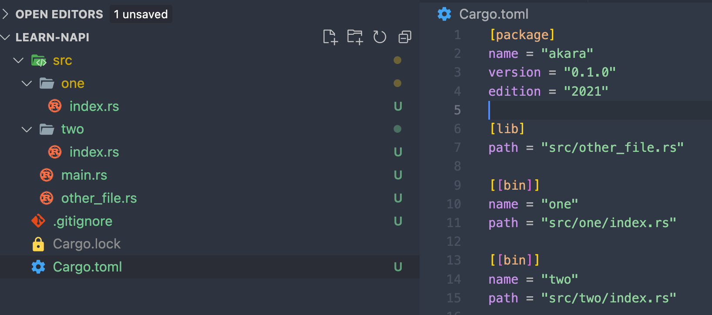

# 包管理与模块

Rust中的Cargo提供了类似Node中NPM的能力，包括项目的初始化、模块的安装与管理、便捷的脚本命令等功能。


## 命令

### cargo new

``` shell
cargo new <xxx> # create bin template project
cargo new <xxx> --lib # create lib template project
```


### cargo build

``` shell
cargo build # build all binary crates
cargo build --bin <xxx> # build specific binary crate
```


### cargo run

``` shell
cargo run # build and running, 要求只存在一个binary crate
cargo run --bin <xxx> # build and running
```


### cargo publish

在我们发布我们的Rust包前，我们首先需要通过`cargo login`进行本机登录，再通过`cargo publish`进行发布。


### cargo install

通常我们通过`cargo install`来安装别人发布的二进制包，拉下代码后会自动通过`cargo build --release`构建可执行文件。


## Binary/Library Crate

`Cargo.toml`所处的根目录被我们视为一个Rust项目（或者叫Rust包），每个Rust项目通常由一个或多个Crate组成，其中包含最多一个的**Library Crate**和可以存在多个的**Binary Crate**。

在默认情况下，`src/main.rs`文件会被视为一个Binary Crate的入口，该入口文件中需要实现`main`函数，**这个Crate的名称默认为Rust包的名称**；而`src/lib.rs`会被视为Library Crate的入口，**Crate名也同样为Rust包的名称**。通过修改`Cargo.toml`配置，我们可以指定Crate的名称和入口文件的路径。



对于上图的Rust项目，我们能够清晰的看到存在着一个Library Crate（名称为akara，路径为`src/other_file.rs`）和三个Binary Crate（名称分别为akara、one和two），此时我们的`cargo build`和`cargo run`命令需要通过`--lib <xxx>`来指定Crate的名称。


## 模块化

在上文中我们介绍了Rust包中可以同时包含多个Crate，而每个Crate都可以被视为一棵**模块树**，上文提到的`src/main.rs`、`src/lib.rs`则为对应的模块树的入口文件。我们可以在入口文件中声明函数乃至**模块**，来扩充整个模块树的内容。

为了演示，我们可以在入口文件`src/lib.rs`中声明三个函数`One`、`Two`、`Three`，那么此时整个模块树的结构如下：

``` shell
crate
  - One
  - Two
  - Three
```

可以看到模块树的根部用关键字`crate`来表示，此时我们的结构是扁平的，通过在入口文件`src/lib.rs`中使用**`mod`关键字声明模块**，比如在我们的例子中我使用`mod Apple`来声明模块Apple，编译器会根据一定的优先级来寻找该模块并加入到我们的模块树当中。

1. 寻找本文件中是否存在对应的内联模块，比如：

   ``` rust
   mod Apple {
   	pub fn A() {
       println!("A");
     }
     pub fn B() {
       println!("B");
     }
     pub fn C() {
       println!("C");
     }
   }
   ```

2. 寻找同目录下是否存在`src/Apple.rs`文件

3. 寻找同目录下是否存在`src/Apple/mod.rs`文件

此时，我们的模块树演变成了如下结构，我们可以在代码中通过形如`crate::Apple::B`的方式来引用模块中的任意公开内容，这里的`crate`关键字表示我们自身的Crate，我们也可以使用`std::fs::read`的方式来引用第三方模块，甚至我们可以通过我们项目的包名来引用项目中Library Crate的内容，比如`akara::utils::xxx`

``` 
crate
  - One
  - Two
  - Three
  - Apple
    - A
    - B
    - C
```


## 隐私规则

在上一节中我们介绍了Rust的模块化规则，当然并不是模块中的所有内容都可以被其他模块引用，我们需要在这些内容的声明前添加添加`pub`前缀，比如：

``` rust
pub fn hello() {}

pub mod Apple;
```


## use关键字

在模块化一节中我们还介绍了通过类似`crate::Apple::B`的形式来引用某个Crate模块树中的某个值，但这个值需要在多个地方中使用的话这么写会显得有些繁琐，所以Rust提供了**关键字`use`**来帮助我们简化使用的流程。

``` rust title="src/main.rs"
mod Apple;
use crate::Apple::B;

fn main() {
  B();
  B();
  B();
}
```

